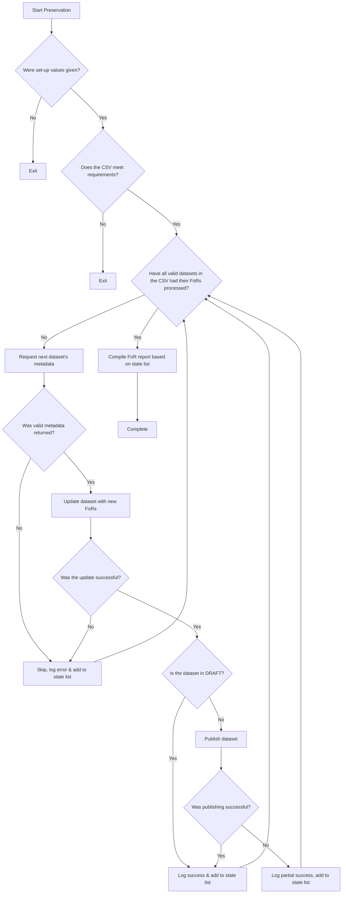

# Fields of Research (FoR) Code Addition

## Fields of Research (FoR) Background

The 2008 ANZSRC FoR classification allows R&D activity to be categorised according to the field of research. In this respect, it is the methodology used in the R&D that is being considered. The categories in the classification include major fields and related sub-fields of research and emerging areas of study investigated by businesses, universities, tertiary institutions, national research institutions and other organisations.

[View all FoR Classifications and Definitions by Division, 2020](https://www.abs.gov.au/AUSSTATS/abs@.nsf/Lookup/1297.0Main+Features12020?OpenDocument)

## 'Australian Data Archive' Context

Much of the Australian Data Archive's datasets on `Dataverse (Production)` are missing their equivalent FoR codes. A `.csv` file had been compiled to correlate a given dataset to it's FoR codes but manually writing each FoR code(s) to each dataset would become a long process. Instead, a script was developed to automate this process and mass update all datasets to include their FoR codes. The original version of the script which was written in 2020 has been superseded with a new updated version which utilises new Dataverse APIs for updating the datasets, as well as command-line arguments to allow for maintainability.

As part of the Australian Data Archive's requirements, the script abides by the following rules:

- If the dataset already has FoR codes, the new FoR codes are **APPENDED** to the metadata, and **ARE NOT REMOVED**
- If the dataset's most recent version **IS** currently in `DRAFT` mode, update the FoR codes **BUT DO NOT PUBLISH** 
- If the dataset's most recent version **IS NOT** currently in `DRAFT` mode, update the FoR codes **AND PUBLISH**

# Execution

## Step 1. Create and populate `.env` file
```sh
# you don't have to follow the command below, create and populate the file however you like
echo -e 'DATAVERSE_URL="YOUR_TARGET_INSTANCE"\nDATAVERSE_API_KEY="YOUR_API_KEY"' >> .env  
```

## Step 2. Install Poetry
```sh
# python3.11 -m pip install poetry (if 'pip' isn't added to your PATH)
pip install poetry
```

## Step 3. Install dependencies
```sh
# python3.11 -m poetry install (if 'poetry' isn't added to your PATH)
poetry install
```

## Step 4. Enter shell
```sh
# python3.11 -m poetry shell (if 'poetry' isn't added to your PATH)
poetry shell
```

## Step 5. Execute Script
```sh
# provide the csv path directly if you don't want to set an environment variable
# e.g., python src/main.py Dataverse_prod_For_Codes_31-07-2024.csv
export CSV=PATH_TO_CSV_FILE
python src/main.py $DIRECTORY 
```

## Example Output

```sh
python src/main.py Dataverse_FoR_Codes.csv                
Beginning to append FoR codes to Dataverse...

100%| ███████████████████████████████████████████████████████████████████████████| 38/38 [00:00<00:00,  3.05it/s]

Completed appending FoR codes to Dataverse!
 - View logs of this script to ensure that there were no problems: /Users/1150325cass060389/Workspace/FOR-code-Adding/logs/for-code-addition-2024-08-02T10:51:10.951181.log
 - See a CSV record of successful and failed FoR code transactions: /Users/1150325cass060389/Workspace/FOR-code-Adding/FoR-Output-2024-08-02T10:51:11.401899.csv
```

# Script Arguments

## Positional Arguments

- `csv` (first position argument)  => preservation output location

## Optional Arguments

- `-f, --for_column_name` => specifies what the FoR column-name is, e.g. `--for_column_name EXAMPLE_COLUMN` will use the column "EXAMPLE_COLUMN" as the FoR column within the script.
- `-d, --doi_column_name` => sets Dataverse URL (default: `https://dataverse.ada.edu.au`), e.g. `--url https://fake.dataverse.ada.edu.au` will set the URL to "https://fake.dataverse.ada.edu.au"

# Execution Flowchart

> Certain steps such as *"Were set-up values given?"* and *"Does the CSV meet requirements?"* were simplified for the flowchart for clarity.



# Short-Comings

## Inflexible CSV Cleaning

The cleaning of the triplets is hard-coded to:

1. Remove any `\"` characters;
2. Split by a `~` delimiter;
3. And, split by a `;` delimiter

> For further information and examples about how cleaning occurs, view the docstring for the function `clean_dataset()` in `./src/util.py`


